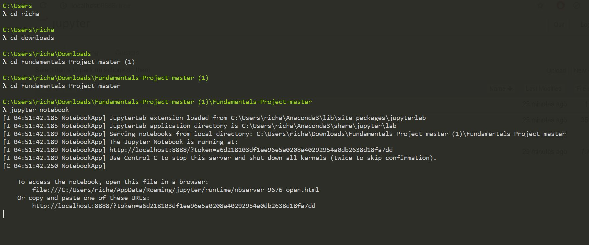

<h1 align ="center">Tips Data Set Project 2019</h1>

<h2 align ="center">Fundamentals of Data Analysis Project 2019</h2>
<h2 align ="center">Created by Richard Feeney</h2>
 

# Introduction

### Tips Data Set Project Outline And Objectives

 The following project is based on the well-known Tips data set. In this project I will use a .csv file for researching and explaining what the data set is all about and write scripts using the Jupyter and Seaborn Packages to backup my findings. This project will be broken down into three parts and these are as follows
 

1. <b><i>Description</i></b>: Create a git repository and make it available to view online via GitHub. Within the repository, create a Jupyter notebook that uses descriptive statistics and plots to describe the dataset.  
2. <b><i>Regression</i></b>: Add a section that discusses and analyses whether there is a relationship between the total bill and tip amount.   
3. <b><i>Analyse</i></b>: Analyse the relationship between the
variables within the dataset.

  

### Link to Project Instructions
https://github.com/richardfeeney7/Fundamentals-Project/blob/master/Project%20Instructions.pdf

### How To Run The Tips Dataset

1. Download the Cmder command line or use the command line on your computer.  
2. Go to Github, find my repository or use the following link https://github.com/richardfeeney7/Fundamentals-Project.git. Click on the Clone/Download button and select download zip.   
3. Once downloaded go to the command line and navigate to this  download using the cd command. When I download the zip file, I first had to unzip it and cd into it, and within that folder I had another folder that I need to cd into also.  
4. Once in the correct location type Jupyter Lab or Jupyter Notebook into the command like. This will open a web server where you can access the files. Depending on the settings this might open Internet Explorer, I would recommend closing that web page and use the web address that you can see in the command line.   
5. When you open the web server and can file my project then open the <u><b><i>.ipynb</i></b></u> document to view the project.   
6. See the below photo of steps that I took, please note that your machine and downloads might be in a different location. 
7. If you want to view the file on GitHub and it displays that something is wrong please copy the URL and go to https://nbviewer.jupyter.org/ and the URL in the box provided. 

### Biobliography

1. Tutorialspoint.com. (2019). Seaborn - Linear Relationships - Tutorialspoint. [online] Available at: https://www.tutorialspoint.com/seaborn/seaborn_linear_relationships.htm [Accessed 12 Oct. 2019].
2. Tutorialspoint.com. (2019). Seaborn - Facet Grid - Tutorialspoint. [online] Available at: https://www.tutorialspoint.com/seaborn/seaborn_facet_grid.htm [Accessed 12 Oct. 2019].
 

